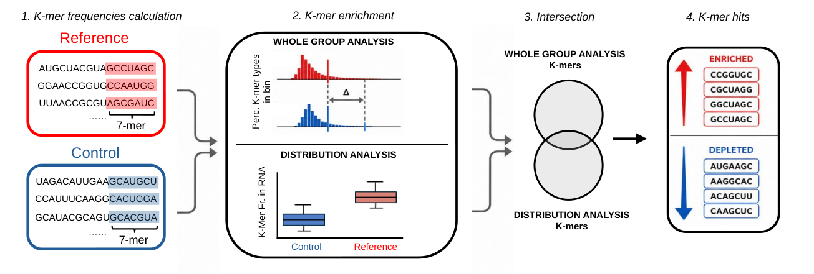
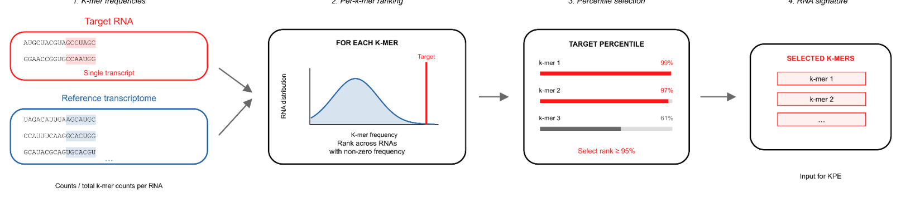
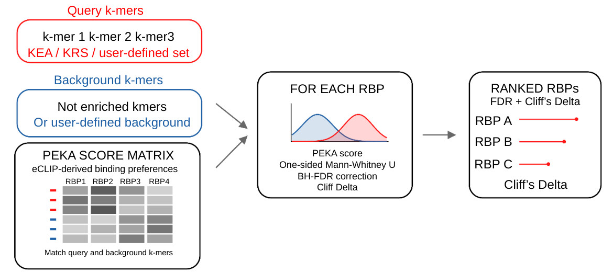
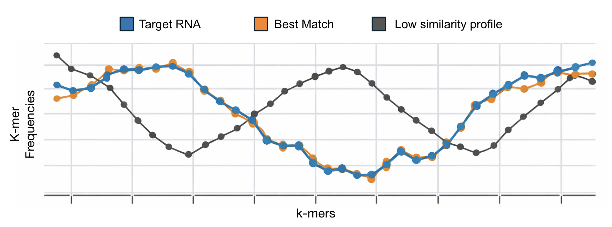

# K-tools

### From RNA sequence to candidate regulatory elements and proteins

K-tools identifies k-mer signatures in transcript populations and individual RNAs, then associates those signatures with experimentally derived RNA-binding protein (RBP) profiles. It works with transcript-oriented sequences and does not require preselected binding regions.

**[Documentation](docs/Documentation.md) · [Tutorial](docs/Tutorial.md) · [FAQs](docs/FAQs.md) · [Methodology](docs/Methodology.md) · [Wiki](https://github.com/AngeloDAngelo/Ktools/wiki)**

## Choose a module

| Module | Biological question | Input | Main output |
| :--- | :--- | :--- | :--- |
| **KEA** — K-mer enrichment analysis | Which sequence elements distinguish two RNA populations? | Reference and control FASTA files | Enriched and depleted k-mers |
| **KRS** — K-mer RNA signature | Which k-mers are unusually abundant in one RNA? | Target RNA and a background population | Transcript-specific percentile-rank signature |
| **K-RBP** — K-mer RBP association | Which RBP profiles favor the signature? | Signature and k-mer × RBP score matrix | Association statistics and candidate proteins |
| **K-map** — Transcript profile comparison | Which RNAs have similar k-mer profiles? | Query and candidate transcript profiles | Ranked similarities and Sankey-style alignment |
| **K-CDS** | Where do selected CDS k-mer occurrences overlap UniProt features? | Full-transcript FASTAs, matching GTF and UniProt BED tracks | CDS frame distribution, enrichment statistics and heatmap |
| **K-miR** | Which miRNA families have seed matches in the signature? | Selected 7-mers and miRNA family table | Exact target seed annotations and KEA/KRS score plots |

These analyses are exposed through the Python `KEA` class. Positional profiling can further locate signature elements along a transcript.

## Install

Download this repository using **Code → Download ZIP**, extract it, and open a terminal inside the extracted directory.

```bash
python3 -m venv .venv
source .venv/bin/activate
python -m pip install --upgrade pip
python -m pip install .
python examples/run_demo.py --out results/demo
```

On Windows, activate with `.venv\Scripts\activate` instead. The demonstration uses synthetic sequences and a fictional RBP score matrix. It exercises KEA, KRS and K-RBP. See [installation details](docs/Installation.md).

## Dependencies

Python ≥3.10 is required. `python -m pip install .` installs the runtime libraries declared in `pyproject.toml`: NumPy, pandas, SciPy, scikit-learn, statsmodels, Biopython, matplotlib, seaborn, Logomaker, pybiomart, WordCloud and matplotlib-venn. See [installation and library roles](docs/Installation.md) for version constraints and development installation.

## How the modules work

### KEA

KEA counts overlapping k-mers in reference and control RNA populations. It combines a population-level frequency comparison with a statistical comparison of normalized transcript frequencies. Intersecting their selected lists yields a signature supported by both analyses.



### KRS

KRS uses the combined RNA population to rank each k-mer's frequency in a target transcript against its nonzero frequencies in other transcripts. The chosen upper percentile defines the target's signature; background composition and the percentile threshold determine its interpretation.



### K-RBP

K-RBP compares scores for signature k-mers against background k-mers in each RBP profile. Longer signature elements can be decomposed into shorter matrix k-mers. The output includes association statistics, multiple-testing corrections and effect sizes. These associations nominate candidate proteins; they are not direct binding measurements for the target RNA.




### K-map: transcript profile comparison

Compare complete transcript k-mer frequency profiles with `CompareTranscriptKmerProfiles`, then visualize selected pairs using the Sankey-style `plot_kmer_rank_alignment`. See [K-map parameters and examples](docs/K-map.md).



### K-CDS

`K_CDS` plots each k-mer’s CDS start-frame distribution against shuffled positions and tests overlap of selected CDS k-mer occurrences with UniProt genomic features using reference/control or shuffled-position backgrounds. Matching full-transcript FASTAs, GTF and BED resources are required. See [parameters, inputs and interpretation](docs/K-CDS.md).

### K-miR

`AnnotateMiRNASeeds` matches selected RNA 7-mers to reverse-complemented miRNA seeds and retains their KEA/KRS scores. See [parameters and orientation](docs/K-miR.md) and the [CDR1as/miR-7 example](docs/CDR1as-miRNA-example.md).

See [module parameters](docs/Module-parameters.md), [methodology](docs/Methodology.md) and the [simulated tutorial](docs/Tutorial.md). Place experimental PEKA matrices in [data/peka](data/peka/README.md).

## Minimal analysis

Save this code as a Python script and run it after installation:

```python
import numpy as np
from KEA import KEA

if __name__ == "__main__":
    np.random.seed(42)
    analysis = KEA("results/my_analysis", "reference.fa", "control.fa")
    analysis.CreateCombinedFasta()
    analysis.KmersCountsTable(k=7, cores=1)
    results = analysis.ExtractKmers(
        k_selected=7,
        extraction_methods=("delta_median", "stat_log2fc"),
        sign_emp_pval=0.01,
        log2fc_threshold=1.0,
        correction_method="bonferroni",
        fdr_alpha=0.05,
    )
    selected = results["input"]
    signature = sorted(
        set(selected["delta_median"]["enriched"])
        & set(selected["stat_log2fc"]["enriched"])
    )
    print(signature)
```

Use uppercase A/C/G/T FASTA sequences, with unique identifiers across both files. The `__main__` guard is required for multiprocessing on platforms using spawn. The [tutorial](docs/Tutorial.md) explains inputs, outputs, thresholds, KRS and K-RBP in detail.

## Repository guide

| Location | Contents |
| :--- | :--- |
| `KEA.py` | Python implementation |
| `docs/` | Documentation, tutorial, FAQs, methodology and figures |
| `examples/` | Runnable demonstration and synthetic FASTA inputs |
| `tests/` | Counting, rank and statistical regression tests |
| `wiki/` | Markdown source pages for the GitHub Wiki |
| `scripts/` | Wiki export helper |

The `wiki/` folder supplies content for the separate GitHub Wiki; uploading the folder alone does not publish the Wiki. Repository documentation is readable immediately after upload.

## Citation and reuse

Please cite **K-tools** using [this repository](https://github.com/AngeloDAngelo/Ktools). The bioRxiv DOI will be added when available. See [Citation](docs/Citation.md).

No software reuse license is currently specified. See [LICENSE-STATUS](LICENSE-STATUS.md) before reusing or distributing the code.
