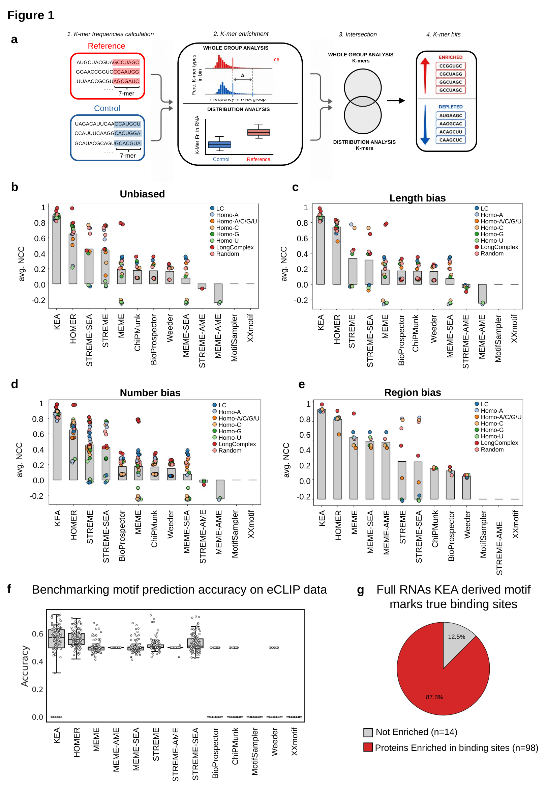

# Benchmarks

[Documentation](Documentation.md) · [Methodology](Methodology.md) · [Data and reproducibility](Data-and-reproducibility.md)

**Status:** the values below are reported in the supplied, unpublished manuscript and presentation. They are approximate summaries, not measurements rerun for this repository. Raw benchmark tables, generation notebooks and comparator wrappers were not supplied. The counting correction in this development snapshot requires a new verification run before treating these results as release validation.

## Synthetic motif recovery

The manuscript describes five controlled conditions using human protein-coding transcript sequences shorter than 5,000 nt. Motifs include dinucleotide repeats, homopolymeric 7-mers, mixed homopolymers, random 7-mers and a longer heterogeneous sequence. In group comparisons, motifs replace sequence on a non-overlapping grid at a substitution fraction of 0.5.

| Condition | Design | KEA mean NCC, approximate | HOMER mean NCC, approximate |
| --- | --- | ---: | ---: |
| Unbiased | Matched length distribution and group size | 0.88 | 0.65 |
| Length bias | Reference and control from different length quantiles | 0.88 | 0.74 |
| Number bias | One group reduced to 25% of its size | 0.88 | 0.65 |
| Region bias | Injection restricted to 5′UTRs | 0.92 | 0.82 |
| Gradient | Motif abundance increases along a synthetic score | 0.90 | Not individually reported in the draft summary |

The draft reports other methods below 0.6 in the gradient design. Exact method-by-condition values should be supplied as source data before release. [Machine-readable reported summaries](../benchmarks/reported_summary.tsv) preserve the approximate status of each value.

**Metric:** normalized cross-correlation (NCC) is implemented in the manuscript workflow as Pearson correlation between per-nucleotide predicted-occurrence and injected-ground-truth coverage profiles. It is undefined if either profile has zero variance. It is not a classification accuracy. The treatment of unavailable outputs in plotted averages remains to be documented in the original benchmark scripts.

## Comparison workflows

The study compares KEA with twelve comparator workflows: HOMER2; MEME; STREME; MEME–AME; MEME–SEA; STREME–AME; STREME–SEA; BioProspector; ChIPMunk; MotifSampler; Weeder; and XXmotif. These are twelve workflows, not twelve independent motif-discovery algorithms.

The Methods section specifies MEME Suite 5.5.8, HOMER 5.1 and GimmeMotifs 0.18.1, with BioProspector release 4/15/04, ChIPMunk V7/build 10012017, MotifSampler 3.2, Weeder 2.0 and XXmotif 1.6. These comparator tools are not installed by the K-tools package.

For synthetic recovery, the described KEA signature intersects a 0.01 delta-median tail with transcript-level selection at Bonferroni-adjusted P≤0.05 and log₂FC≥1. Comparator control handling differs by tool. FIMO occurrence P values are BH-adjusted separately within each motif in the described wrappers.

## Experimental eCLIP evaluation

The draft starts from 223 ENCODE eCLIP datasets spanning 150 RBPs and reports an evaluated set of 112 RBPs. It uses full-length transcripts with exonic eCLIP peaks as reference, with other transcripts detectable in the compendium as controls. The Methods and Results differ on `>100` versus `≥100` bound transcripts; the exact inclusion rule needs confirmation in the source workflow.

Predictions are evaluated in eCLIP peak intervals and matched exonic control intervals. Accuracy is `(TP + TN) / (TP + TN + FP + FN)`, using presence of a recovered motif as the positive classification. This differs from the synthetic nucleotide-coverage NCC metric.

| Method | Median accuracy, approximate | Range, approximate |
| --- | ---: | --- |
| KEA | 0.57 | 0.32–0.73 |
| HOMER | 0.55 | 0.42–0.71 |
| MEME/STREME-based workflows | 0.49–0.50 | Not numerically tabulated in the draft |

The small separation from HOMER should remain visible when interpreting these results. Failed or empty eCLIP outputs were assigned zero performance in the described workflow, whereas missing files were excluded. This convention conflates some execution outcomes with prediction performance and should be reported alongside valid-run results.

## Agreement with PEKA

The presentation explicitly reports **98 of 112 RBPs (87.5%)** with positive median PEKA-score differences and BH-adjusted P<0.05; 14 of 112 do not meet that criterion. This comparison decomposes the transcript-derived 7-mers to 5-mers and compares scores using a two-sided Mann–Whitney U test. It differs from the one-sided, profile-level K-RBP association test.

Both analyses use information derived from eCLIP. Agreement is complementary evidence for binding-associated sequence preferences, not independent experimental validation and not 87.5% binding-site accuracy.

## Original benchmark figure

The figure is a raster export of the supplied presentation; the graph values were not reconstructed. [Supplementary synthetic comparisons](assets/benchmark-supplement.png) show condition-specific plots. See [Figure provenance](Figures.md) for source slide mapping.

## Reproducing the study

The included synthetic demo is only a software exercise. Full study reproduction requires the original sequence sets, injected coordinates, random seeds, wrappers, raw performance tables, ENCODE accessions, curated PEKA matrices and figure notebooks. These are listed in [the reproducibility inventory](Data-and-reproducibility.md).
