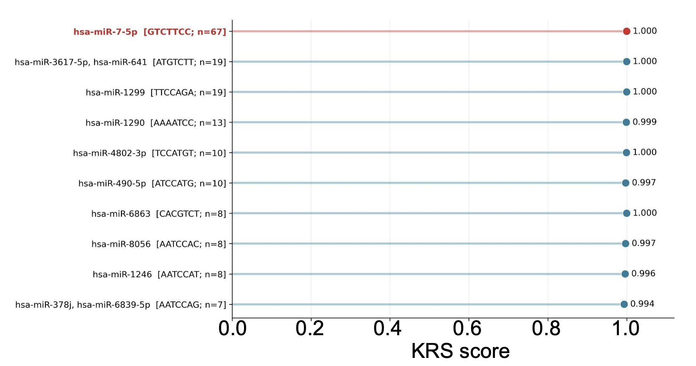

# K_miR example: CDR1as / ciRS-7

[K_miR](MiRNA-seeds.md) · [Tutorial](Tutorial.md)

CDR1as is a published miR-7-binding circular RNA ([Hansen et al., 2013](https://doi.org/10.1038/nature11993)). This example annotates its selected seven-nucleotide words with complementary human miRNA seeds.

## Sequence

The [circBase record hsa_circ_0001946](https://www.circbase.org/cgi-bin/singlerecord.cgi?id=hsa_circ_0001946) defines a 1,485-nt, positive-strand circular interval at hg19 chrX:139865339–139866824 (zero-based, half-open). Ensembl assembly mapping places it at GRCh38 X:140783175–140784659 (one-based, inclusive). The sequence was retrieved from the Ensembl genomic sequence endpoint. [Coordinates, retrieval URL and checksum](../examples/data/CDR1as_provenance.json).

## Run

Supply a background FASTA and use a new output directory:

```bash
python examples/run_cdr1as_mirna.py --background /path/to/lncRNA.fa --out results/cdr1as_mirna --top-pct 5
```

The example script streams transcripts rather than creating a dense count matrix. It normalizes canonical counts per transcript, excludes zero-frequency observations for each word, includes the target, and averages tied ranks. It then calls `AnnotateMiRNASeeds` on words with KRS percentile ≥0.95. Duplicate identifiers are rejected; identical target sequences are excluded from the background.

The script uses the reference-class counting boundary: 1,478 seven-nucleotide windows from the 1,485-nt linearized sequence. It omits the final possible window and does not count junction-spanning windows.

## Example figure



The figure displays ten seed-matched target words in decreasing occurrence-count order. Labels identify mature miRNAs, target words and counts; points show KRS percentile scores rounded to three decimals. [Displayed values](../examples/cdr1as_expected/displayed_seed_scores.tsv).

The miR-7-5p seed `GGAAGAC` matches `GTCTTCC` (DNA) / `GUCUUCC` (RNA). This word occurs 67 times in CDR1as, giving a reference-counter frequency of 67/1,478 = 0.04533. It is highlighted in red and has a displayed KRS score of 1.000.

This is a custom example display. `AnnotateMiRNASeeds(plot=True)` produces its default bar plot; results depend on the comparison FASTA and selection parameters.

Exact seed matches nominate compatible miRNAs. They do not establish expression, binding or sponge activity; KRS percentiles are not P values.
